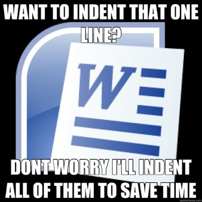
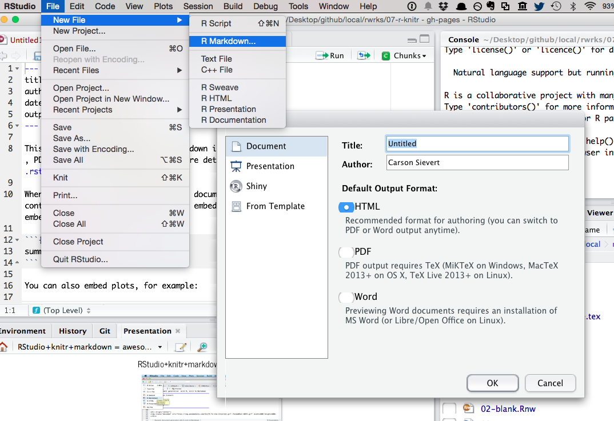
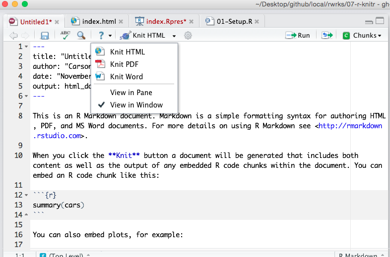
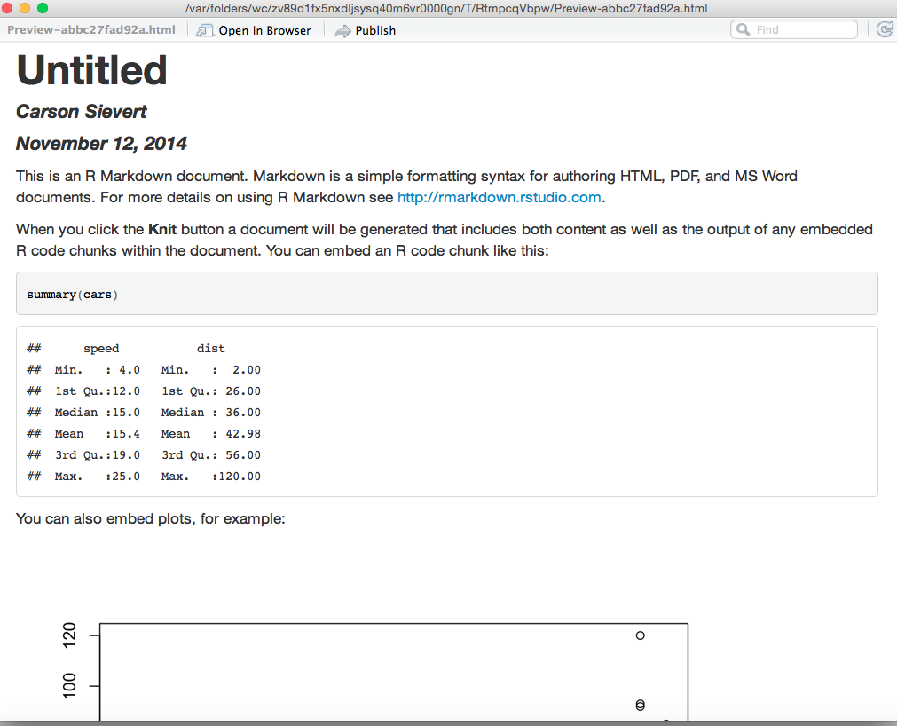

Test deck in R presentation
========================================================
author: Jack Olney
transition: rotate
incremental: true

Follow along at - http://cpsievert.github.io/slides/markdown

Why use Markdown?
========================================================

* Easy to learn and use.
* Focus on __content__, rather than __coding__ and debugging __errors__.
* It's flexible. Markdown was created to simplify HTML, but with the right tools, your Markdown files can easily be converted to many different formats!
* Fastest way to internet! <p></p> <div align="center"></div>

What is Markdown?
========================================================

* Markdown is a particular type of markup language.
* Markup languages are designed produce documents from plain text.
* Some of you may be familiar with _LaTeX_. This is another (less human friendly) markup language for creating pdf documents.
* _LaTeX_ gives you much greater control, but it is restricted to pdf and has a __much__ greater learning curve.
* As I mentioned, there are tools (mainly [pandoc](http://johnmacfarlane.net/pandoc/)) that allow you to render markdown in different formats (for example, HTML/pdf/word)

Yes, even word documents...
========================================================

<div align="center">

</div>

knitr + markdown + pandoc = rmarkdown
========================================================

* `rmarkdown` is a new package from RStudio that merges a lot of technologies in an exciting way.
* In fact, in RStudio now, you integrate R code into your Markdown document and render as HTML/pdf/Word in the click of a button! <p></p> <div align="center"></div>
* You can even embed your shiny apps in HTML documents generated with `rmarkdown`!

Some Examples
========================================================

* [R learning resources at UCLA by Joshua Wiley et al](http://www.ats.ucla.edu/stat/r/)
* [Advanced R programming by Hadley](http://adv-r.had.co.nz/memory.html)
* [The rmarkdown website](http://rmarkdown.rstudio.com/)
* [Tufte](https://github.com/jimhester/knitrBootstrap?source=c) style [HTML](http://cran.r-project.org/web/packages/tufterhandout/vignettes/example.html) and [pdf](http://rmarkdown.rstudio.com/examples/tufte-handout.pdf) documents.
* [shiny](https://cpsievert.shinyapps.io/animintRmarkdown/) apps!
* Inject custom JavaScript for [interactive visualizations](http://timelyportfolio.github.io/rCharts_nyt_home_price/).

Markdown Basics
========================================================
incremental:false
title:false
right: 55%

Markdown syntax

    Header 1
    ================
    Header 2
    ----------------
    ### Header 3
    
    This is regular text.
    
    > This is a blockquote.
    > 
    > This is the second paragraph in the blockquote.
    >
    > ## This is an H2 in a blockquote

***
Resulting HTML
```
<h1>Header 1</h1>
<h2>Header 2</h2>
<h3>Header 3</h3>

<p>This is regular text.</p>

<blockquote>
<p>This is a blockquote.</p>

<p>This is the second paragraph in the blockquote.</p>

<h2>This is an H2 in a blockquote</h2>
</blockquote>
```
  
Header 1
================
incremental:false

Header 2
----------------
### Header 3

This is regular text.
    
> This is a blockquote.
> 
> This is the second paragraph in the blockquote.
>
> ## This is an H2 in a blockquote


Markdown Basics 2
========================================================
incremental:false
title:false
right: 55%

Markdown syntax

    Here we have an unordered list.
    
    * Item 1
    * Item 2
      * Item 2a
      * Item 2b
      
    Here we have an ordered list
    
    1. Item 1
    2. Item 2
      * Item 2a
      * Item 2b

***
Resulting HTML
```
<p>Here we have an unordered list.</p>
<ul>
<li>Item 1</li>
<li>Item 2
<ul>
<li>Item 2a</li>
<li>Item 2b</li>
</ul></li>
</ul>
<p>Here we have an ordered list</p>
<ol>
<li>Item 1</li>
<li>Item 2
<ul>
<li>Item 2a</li>
<li>Item 2b</li>
</ul></li>
</ol>
```

Result 2
======================
title:false
incremental:false

Here we have an unordered list.
    
* Item 1
* Item 2
  * Item 2a
  * Item 2b
      
Here we have an ordered list
    
1. Item 1
2. Item 2
  * Item 2a
  * Item 2b

Markdown Basics 3
========================================================
incremental:false
title:false
right: 55%

Markdown syntax

    What if we want to *italicize* or **bold**?
    
    * In a list, I may want to _italicize_ or __bold__ this way.
   
    I can also include inline `code` or 
    
    ```
    blocks of code
    ```
    Or even a [link](http://google.com)
    

***
Resulting HTML
```
<p>What if we want to <em>italicize</em> or <strong>bold</strong>?</p>
<ul>
<li>In a list, I may want to <em>italicize</em> or <strong>bold</strong> this way.</li>
</ul>
<p>I can also include inline <code>code</code> or </p>
<pre><code>blocks of code</code></pre>
<p>Or even a <a href="http://google.com">link</a> </p>
```

Result 3
======================
title:false
incremental:false

What if we want to *italicize* or **bold**?

* In a list, I may want to _italicize_ or __bold__ this way.

I can also include inline `code` or 

```
blocks of code
```

Or even a [link](http://google.com)


Markdown Basics 4
========================================================
incremental:false
title:false
right: 50%

Markdown syntax
    
    When in doubt, you can always put HTML into markdown:
    
    
    
    I can also do fancy latex equations $\alpha = \beta$ with help from [MathJax](http://www.mathjax.org/)
    
***
Resulting HTML
```
<p>When in doubt, you can always put HTML into markdown:</p>

<p></p>

<p>I can also do fancy latex equations \( \alpha = \beta \) with help from <a href="http://www.
mathjax.org/">MathJax</a></p>

```

Result 4
======================
title:false
incremental:false

When in doubt, you can always put HTML into markdown:
    

    
I can also do fancy latex equations $\alpha = \beta$ with help from [MathJax](http://www.mathjax.org/)


RStudio + rmarkdown = awesome
========================================================

<div align="center">

</div>

RStudio + rmarkdown = awesome
========================================================
title:false

<div align="center">

</div>

RStudio + rmarkdown = awesome
========================================================
title:false

<div align="center">

</div>


For non-RStudio users...
========================================================
incremental:false
right:53%
    
    This is an R Markdown document.
    
    ```{{r}}
    summary(cars)
    ```
    
    You can also embed plots, for example:
    
    ```{{r fig.width=7}}
    plot(cars)
    ```
***

Save the content to the left in your working directory as "index.Rmd". Then run the code below to replicate "knit HTML".


```r
library(knitr)
knit2html("index.Rmd")
browseURL("index.html")
```

This is actually equivalent to:


```r
library(rmarkdown)
render("index.Rmd")
browseURL("index.html")
```

Custom styling...
========================================================
incremental:false

* It's easy to customize styling using the `markdownToHTML` function from the `markdown` package.


```r
knit("index.Rmd") #generates 'index.md' file
library(markdown)
markdownToHTML("index.md", "index.html", stylesheet='custom.css')
```

* If you have `rmarkdown`, there are some nice templates you can use (File -> New File -> R Markdown -> From Template)

Your Turn
========================================================

* Go to: File -> New File -> R Markdown
* Try out different output formats and pick one that you like!

The power of code chunks
========================================================
incremental:false
right:40%

    Title
    ====================

    This is an R Markdown document.

    ```{{r results='asis'}}
    library(knitr)
    kable(head(cars), 'html')
    ```
    
    You can also embed plots, for example:

    ```{{r fig.width=7, fig.height=6, echo=FALSE}}
    plot(cars)
    ```


Title
========================================================
incremental:false
title:false
left:57%


This is an R Markdown document.


```r
library(knitr)
kable(head(cars), 'html')
```

<table>
 <thead>
  <tr>
   <th style="text-align:right;"> speed </th>
   <th style="text-align:right;"> dist </th>
  </tr>
 </thead>
<tbody>
  <tr>
   <td style="text-align:right;"> 4 </td>
   <td style="text-align:right;"> 2 </td>
  </tr>
  <tr>
   <td style="text-align:right;"> 4 </td>
   <td style="text-align:right;"> 10 </td>
  </tr>
  <tr>
   <td style="text-align:right;"> 7 </td>
   <td style="text-align:right;"> 4 </td>
  </tr>
  <tr>
   <td style="text-align:right;"> 7 </td>
   <td style="text-align:right;"> 22 </td>
  </tr>
  <tr>
   <td style="text-align:right;"> 8 </td>
   <td style="text-align:right;"> 16 </td>
  </tr>
  <tr>
   <td style="text-align:right;"> 9 </td>
   <td style="text-align:right;"> 10 </td>
  </tr>
</tbody>
</table>

***
You can also embed plots, for example:


Interactive Plots
========================================================
incremental:false


```
Error in library(rCharts) : there is no package called 'rCharts'
```
